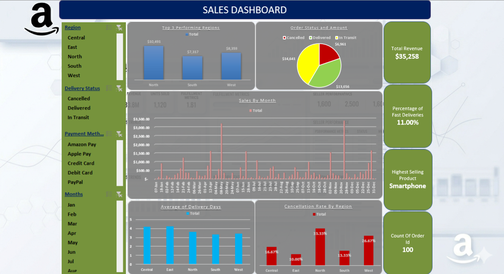
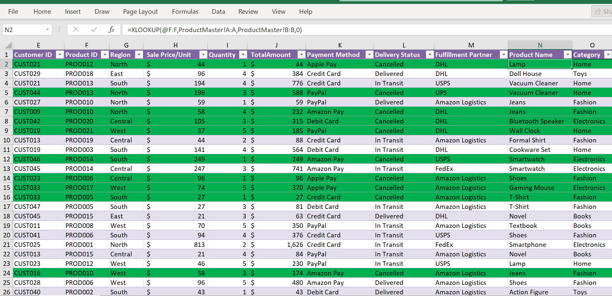
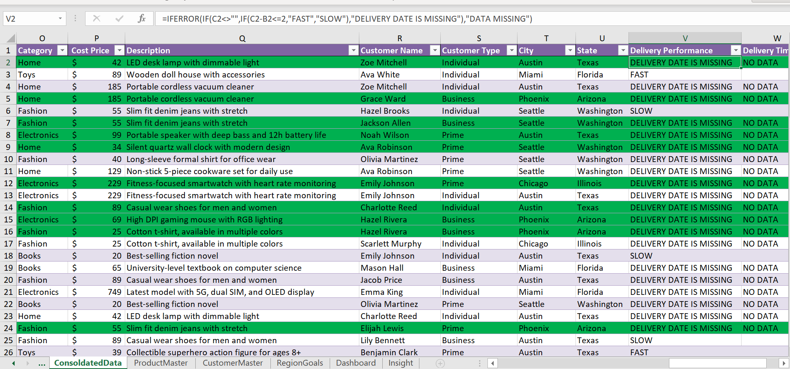
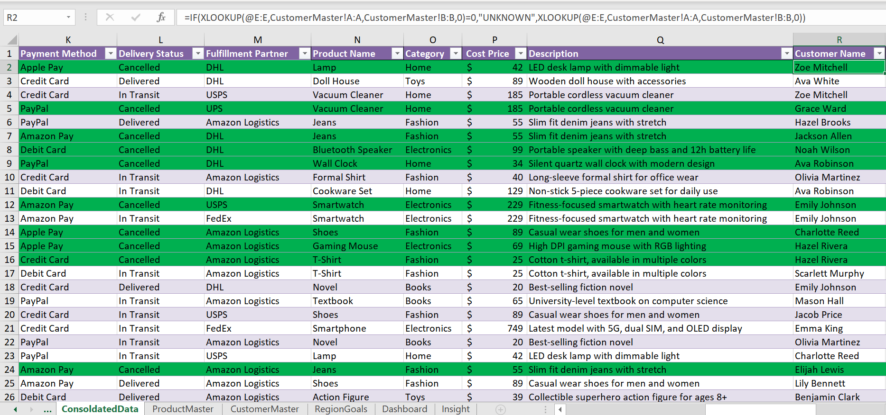
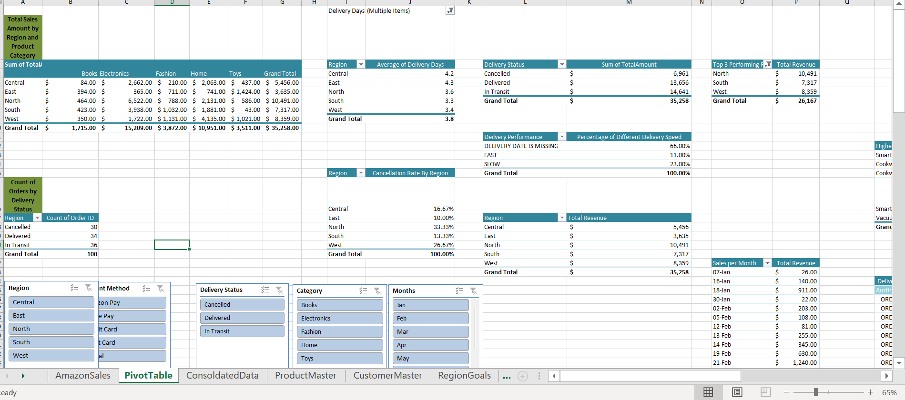

# ecommerce-logistics-fulfillment-audit

# Global E-Commerce Logistics & Order Fulfillment Audit

An institutional multi-sheet Excel analytical framework built to optimize international supply chain operations, isolate processing delays, and track regional revenue performance. This project monitors 100 global transactional order paths, linking relational lookups, dynamic delivery metrics, and automated pivot tables into a clean business intelligence dashboard.

---

## 1. Core Analytics Objective & Financial Summary

The objective of this framework is to audit shipping latency variations across distribution networks, spot delivery speed bottlenecks, and track gross revenue performance across our core product lines:

*   **Total Accumulated Gross Revenue:** \$35,258.00 total sales captured across all active global regions.
*   **Total Logistical Footprint:** 100 enterprise transactional order profiles tracked down to different delivery status.
*   **Primary Revenue Driver:** The **Smartphone** category, leading the portfolio with **\$9,644.00** in total gross sales.

---

## 2. Workbook Architecture & 8-Sheet Structural Ledger

To demonstrate advanced spreadsheet structure and data modeling standards, the workbook is organized into 8 individual specialized tabs:

1.  **Fulfillment Dashboard:** A clean, executive visual control panel displaying regional cancellation rates, delivery status distributions, and gross monthly sales trends.
2.  **Order Transaction Ledger:** The master database containing order logs, price metrics, quantities, and transaction types.
3.  **Customer Registry Matrix:** A relational lookup database mapping Customer IDs to individual client types (Business, Prime, Individual) and geographic cities.
4.  **Product Catalog Directory:** A structured asset database tracking cost prices, retail values, and product names across 5 core categories.
5.  **Region Performance Lookups:** Connects regional coordinates directly to predefined regional sales target benchmarks.
6.  **XLOOKUP Integration Hub:** Houses the core formulas that connect our tables together, mapping cities, states, and product categories into a single row snapshot.
7.  **Fulfillment Metrics Compiler:** Automatically calculates delivery latencies and maps delivery performance speeds (FAST, SLOW, or CANCELLED).
8.  **Pivot Analysis Sheets:** Dedicated pivot tables that break down total sales by region, average delivery days by shipping partner, and regional cancellation rates.

---

## 3. Core Insights & Logistical Recommendations

### Simplified Multi-Sheet Relational Mapping
By utilizing advanced **XLOOKUP** string arrays, the data pipeline consolidates information across sheets without bloating file memory. This allows business analysts to generate clean pivot reports without manually jumping between individual tabs.

### Regional Performance and Bottlenecks
*   **The Discovery:** The **North Region** is our highest revenue driver (**\$10,491.00**), but it also tracks the highest order cancellation rate. 
*   **The Logistics Fix:** Partner with local delivery service operators in New York, Seattle, and Phoenix to address the high average delivery times in those hubs.

### Delivery Partner Optimization
*   **The Discovery:** **FedEx and USPS** suffer from higher average delivery windows despite handling a lower overall volume of orders. Conversely, **DHL** maintains a fast average delivery timeline while processing a much larger share of shipments.
*   **The Logistics Fix:** Shift our electronics items (which face the longest average shipping delays) over to DHL’s distribution network to optimize our delivery speeds.

---

## 4. Operational Workbook Visual Ledger

### Executive Fulfillment Control Dashboard
Below is the live operational dashboard panel used by logistics teams to monitor gross revenue trends, regional performance metrics, and order status tracking columns in real time:

  

### Relational Lookups & Automated Formula Engines
Below are the backend data matrices showcasing our clean multi-sheet data connections, relational lookup formula networks, and automated error-handling validation parameters:

<table width="100%" style="border-collapse: collapse; border: none;">
  <tr style="border: none;">
    <td width="50%" style="padding: 5px; border: none; text-align: center;">
      
<b>XLOOKUP Data Ingestion Pipeline</b>

      
    </td>
    <td width="50%" style="padding: 5px; border: none; text-align: center;">
      
<b>IFERROR Performance & Boundary Calculations</b>

      
    </td>
  </tr>
  <tr style="border: none;">
    <td colspan="2" width="100%" style="padding: 5px; border: none; text-align: center;">
      
<b>Conditional Lookups & Validation Mappings</b>

      
    </td>
  </tr>
</table>

### Multi-Dimensional Pivot Analysis Sheet
Below is our dedicated calculation matrix workspace, aggregating gross transaction volumes, multi-layered slicer dimensions, and regional latency summaries across active billing footprints:

  

